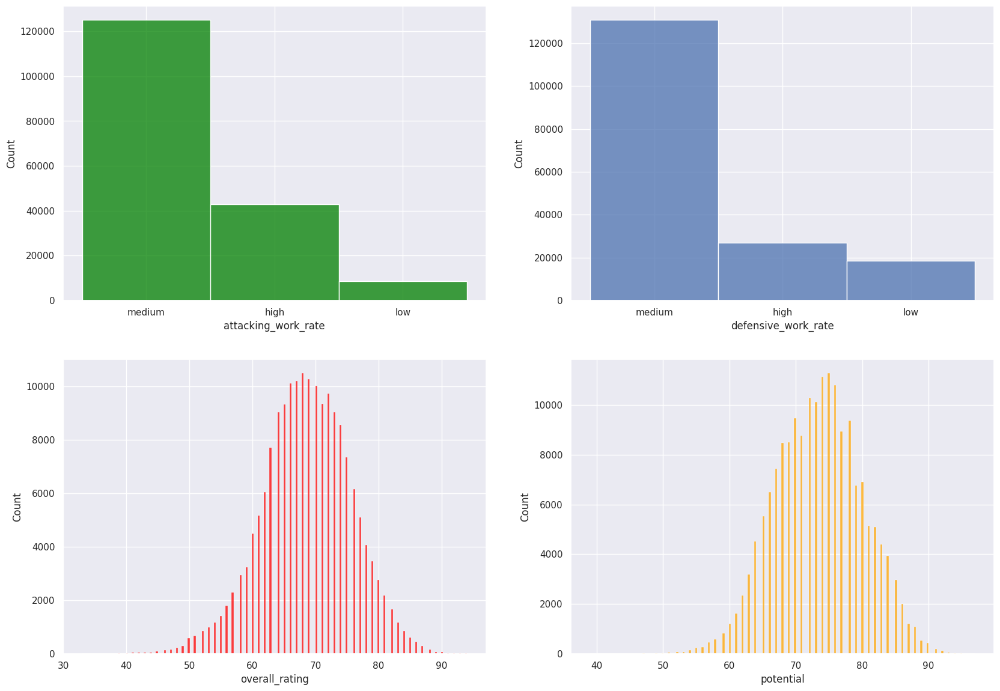
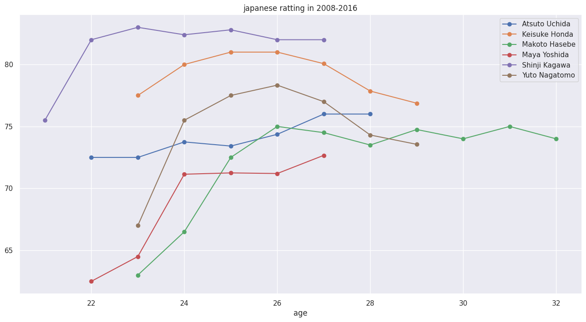
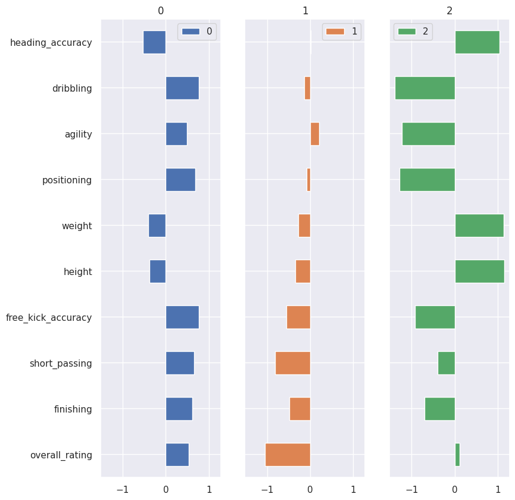
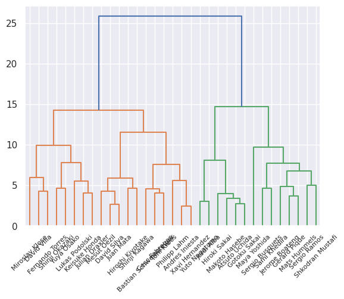

# Football Data Clustering ⚽📊

This repository contains my Jupyter Notebook **Football_Data_Clustering.ipynb**, which explores concepts in Data Science and Machine Learning applied to football analytics.

## 🚀 Features
- Data preprocessing & analysis
- Implementation of clustering algorithms (e.g., K-Means, Hierarchical Clustering)
- Visualization of football-related data
- Beginner-friendly explanations

## 🛠️ Technologies Used
- Python
- Jupyter Notebook
- NumPy, Pandas
- Matplotlib / Seaborn
- Scikit-learn

## 📂 File Structure
- `Football_Data_Clustering.ipynb` → Main notebook
- `README.md` → Project description
- `assets/` → Folder containing saved visualizations

## 🎯 Goals
This project is part of my learning journey in **Machine Learning & Data Science**.  
It focuses on **unsupervised learning** (clustering) and how algorithms like K-Means and Hierarchical Clustering can uncover hidden patterns in football datasets, such as player similarities and tactical insights.

## 📊 Sample Results

Here are some visualizations from the project:  

### 1. Player Work Rates & Ratings Distribution
  
*Distribution of players by attacking/defensive work rates, overall rating, and potential. Most players fall within a medium work rate and average overall rating range.*  

---

### 2. Japanese Player Performance Trends (2008–2016)
  
*Tracking the ratings of notable Japanese players across different ages, highlighting their career progressions and peak performance years.*  

---

### 3. Cluster Feature Importance
  
*Comparison of different clusters based on attributes such as dribbling, agility, passing, and finishing. This highlights what makes each group of players unique.*  

---

### 4. Hierarchical Clustering Dendrogram
  
*A dendrogram showing hierarchical clustering of players, revealing similarities and groupings between footballers based on their attributes.*  

---

## 💡 Future Improvements
- Try more clustering methods (DBSCAN, Gaussian Mixture Models)
- Apply dimensionality reduction (PCA, t-SNE)
- Experiment with larger, real-world football datasets

---

✨ *Feel free to fork this repo, suggest improvements, or use it as a reference for your own ML + football analytics projects!*
